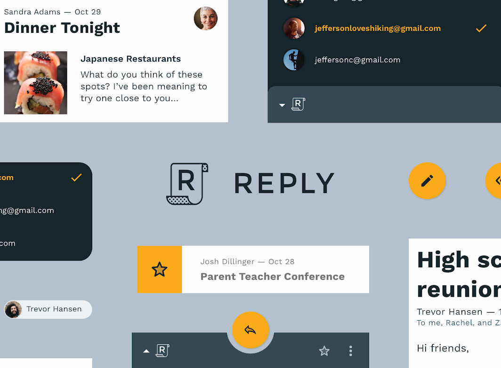

# Reply

The Angular implementation of [Reply](https://m2.material.io/design/material-studies/reply.html) designed by Google.

> Reply is an email app that uses Material Design components and Material Theming to create an on-brand communication experience.
>
> 

# Features

- [Fantastic Material Motion animations](https://github.com/TheNightmareX/reply/discussions/2)
- Excellent UX on Any Screen
- Native-like UI Behavior
- Well-considered Keyboard Accessibility
- Rich Performance Optimizations

# Local Serving

The application depends on multiple internal libraries. Make sure that the libraries have been built before starting the application.

```ts
npm i
npm run build-libs
npm start
```

# Architecture

The architecture of this project follows most of the reasonable principles of the [Angular Coding Style Guide](https://angular.io/guide/styleguide), but also follows my own empirical principles.

- All the paths mentioned below are relative to `projects/reply/src/app`
- The term `component` below refers to anything that is declarable in an Angular Module such as components, directives, and pipes.

## Special Directories

- `/common` - framework/business independent logic that can be reused in any applications
- `/core` - components that is used in `AppModule` and injectables that is shared by the entire application
- `/standalone` - shared standalone components which can be either business-dependent of business-independent.
- `/data` - derived from `/core` where only injectables relevant to data are allowed

## Feature Modules

A feature module refers to a lazy-loading module with routes.

- Feature modules must be flattened at the root of the application
- Un-reusable components must be flattened at the root of the feature module
- Injectables and reusable components must be put under a sub-directory named `core`
- The name of components and injectables of a feature module must share the same prefix as the module.

## Widget Modules

A widget module refers to a module that provides business-independent additional reusable features.

- Widget modules must be flattened to the root of the application
- The internal architecture of a widget module can be flexible
- A widget module should be extracted into a library if possible once it is stable
